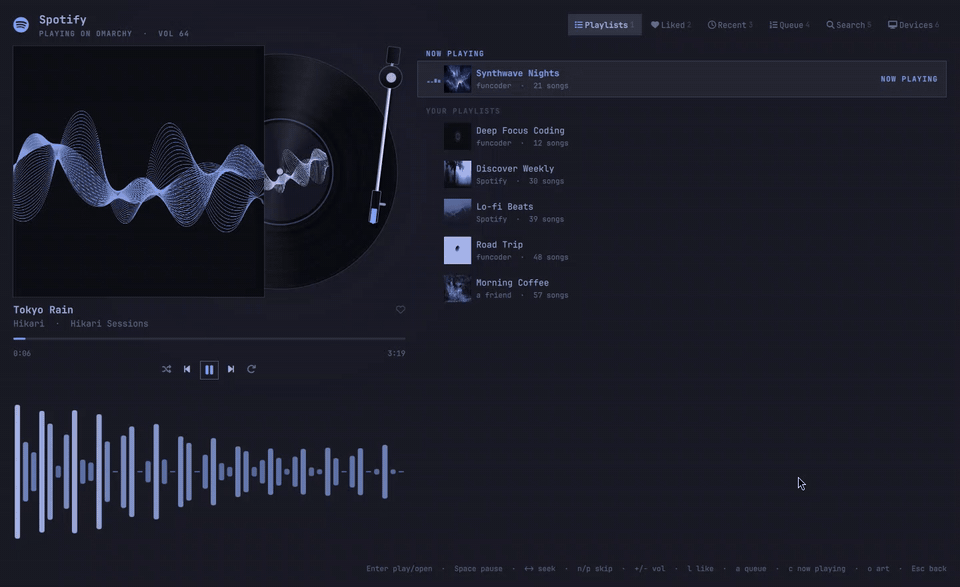
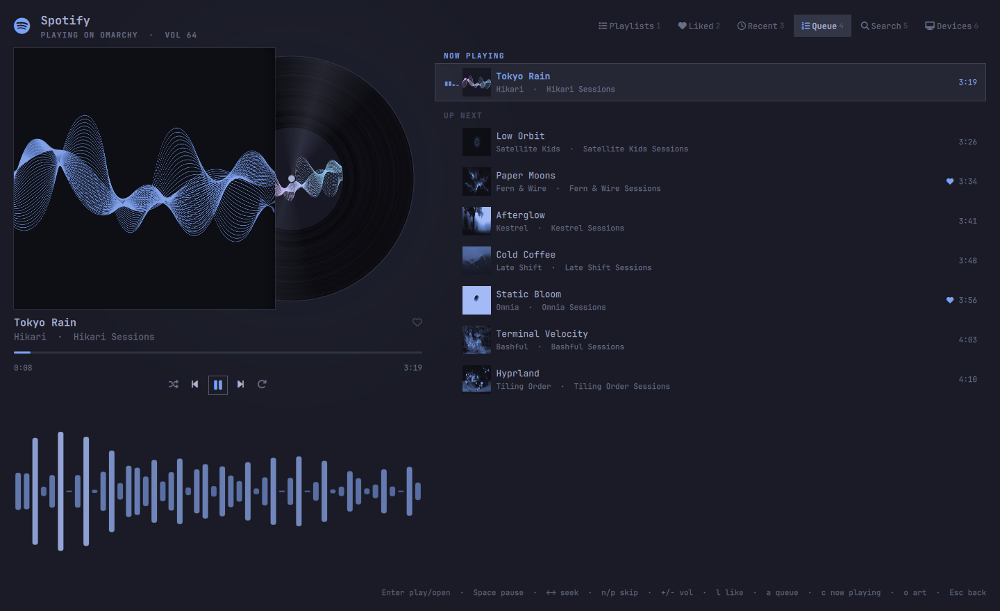

# Spotify Vinyl

A keyboard-driven Spotify player window that lives in the Omarchy shell and wears your
theme.



- **Now playing stage.** The album sleeve with a record that slides out and spins
  at 33⅓ rpm. It eases to a stop on pause and swaps discs when the track changes.
  A tonearm follows the song from the outer groove towards the label. It lifts,
  swings and sets down on play, pause, seek and track changes.
  Behind it is a soft glow that breathes with the music.
- **Omarchified artwork.** A shader maps every cover onto your theme: shadows go
  to the darkest background, highlights to the accent. The selected row shows
  the true colours, and so does the record label. Press `o` to switch between
  omarchified and original art.
- **Live visualizer.** Spectrum bars from [cava](https://github.com/karlstav/cava)
  under the player, in the row that's playing, and in the bar widget.
- **Playlists with what's playing pinned on top.** Press `c` to jump into it.
  There are also tabs for Liked songs, Recent, Queue, Search and Devices
  (Spotify Connect).



*The animation and screenshot use demo mode with the Tokyo Night theme. Every colour follows your current Omarchy theme.*

## Requirements

- [Omarchy](https://omarchy.org) 4 (the Quickshell-based shell with plugins).
- Spotify **Premium**. Spotify requires it for playback control and for developer apps.
- `spotifyd` plays audio on this computer, and `cava` drives the visualizer:

  ```sh
  sudo pacman -S spotifyd cava
  ```

  Without spotifyd you can still control a phone, speaker or other Spotify Connect device.

## Install

```sh
omarchy plugin add https://github.com/funcoder/omarchy-spotify.git --enable
```

Then add a key binding in `~/.config/hypr/bindings.lua` and run `hyprctl reload`.
This one replaces Omarchy's default Music shortcut:

```lua
hl.unbind("SUPER + SHIFT + M")
o.bind("SUPER + SHIFT + M", "Spotify", "omarchy-shell shell toggle funcoder.spotify '{}'")
```

The **Spotify** bar widget can be added from Omarchy's bar settings. Update with
`omarchy plugin update funcoder.spotify`.

## Setup

You connect the player to **your own** free Spotify developer app. No client ID
ships with this plugin.

1. Open <https://developer.spotify.com/dashboard> and choose **Create app**.
   - Name and description: anything.
   - **Redirect URI**: `http://127.0.0.1:19872/login` (exactly this, no trailing slash).
   - APIs used: tick **Web API**.

   Already have an app for [cliamp](https://github.com/bjarneo/cliamp)? Reuse it.
   It uses the same redirect URI, and Spotify only allows one development app
   per account. A `client_id` under `[spotify]` in `~/.config/cliamp/config.toml`
   is picked up automatically.
2. Open the player (`Super+Shift+M`). Paste the app's **Client ID**, press
   Enter, then press Enter again to log in in your browser.
3. Press `d` for **Devices**, then Enter on **This computer**. Your browser opens
   once to connect spotifyd. It then runs as the `funcoder-spotifyd` user service.

### Where things are stored

| What | Where |
| --- | --- |
| Client ID and device name | `~/.config/funcoder-spotify/config.json` |
| Spotify refresh token | Desktop keyring (`secret-tool`, service `funcoder-spotify`) |
| spotifyd config / credentials | `~/.config/funcoder-spotify/spotifyd.conf`, `~/.cache/funcoder-spotify/spotifyd/` |
| spotifyd service | `~/.config/systemd/user/funcoder-spotifyd.service` |

Nothing is sent anywhere except Spotify. The client ID is not a secret (the
login uses PKCE, with no client secret), but it's still kept out of this repo.

### Uninstall

```sh
systemctl --user disable --now funcoder-spotifyd.service
rm ~/.config/systemd/user/funcoder-spotifyd.service
secret-tool clear service funcoder-spotify
rm -rf ~/.config/funcoder-spotify ~/.cache/funcoder-spotify
omarchy plugin remove funcoder.spotify
```

## Keys

| Key | Action |
| --- | --- |
| `↑↓` / `j k` | Move |
| `Enter` | Play a song, open a playlist or album |
| `Shift+Enter` | Play a playlist or album without opening it |
| `Esc` / `Backspace` | Back (close the window with `Super+W`) |
| `Tab` / `1`–`6` | Switch tabs |
| `/` | Search |
| `Space` | Play or pause |
| `← →` | Seek 10 s (`Shift` for 30 s) |
| `n` / `p` | Next or previous song |
| `+` / `-` / `m` | Volume up, volume down, mute |
| `s` / `r` | Shuffle, cycle repeat |
| `l` / `Shift+L` | Like the playing song, or the selected song |
| `a` | Add the selected song to the queue |
| `c` | Open the playlist or album that's playing |
| `o` | Switch between omarchified and original artwork |
| `d` | Devices |

Bar widget: click to open, right click to play or pause, middle click for the
next song, scroll to change the volume.

IPC target for your own bindings: `omarchy-shell funcoder.spotify.player playPause|next|previous|volumeUp|volumeDown|like|status`, and `seek 90` (seconds) or `seek 50%`.

## Limits

Spotify's development-mode API only lists the songs of playlists you **own or
collaborate on**. Followed playlists still play, and once one is playing the
Queue tab shows what's coming up. Search returns 10 results per type.

## Troubleshooting

- **"INVALID_CLIENT: Invalid redirect URI"**: the redirect URI in your Spotify app
  must be exactly `http://127.0.0.1:19872/login`.
- **"No active Spotify device"**: open Devices (`d`) and start **This computer**,
  or pick another device. Logs: `journalctl --user -u funcoder-spotifyd`.
- **Changes to the QML don't show up**: the plugin stays loaded, so run
  `omarchy restart shell`.

## Development

`spotify.py <op> '<json>'` runs one helper request from a terminal. Set
`"demo": true` in `~/.config/funcoder-spotify/config.json` to try the UI with
fake data and a synthetic visualizer (`tools/demo.py`). After editing QML, restart the shell with
`omarchy restart shell`, because the plugin is `keepLoaded`.

## Credits

Playback by [spotifyd](https://github.com/Spotifyd/spotifyd) (librespot).
Visualizer by [cava](https://github.com/karlstav/cava). Not affiliated with
Spotify.
